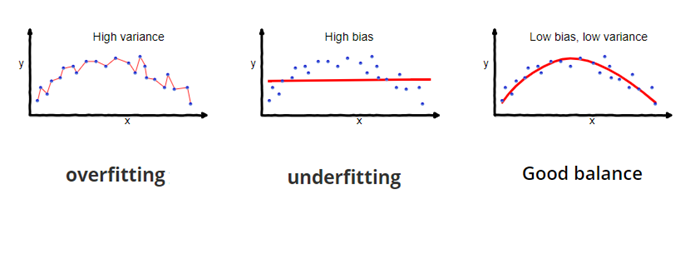

## GETTING STARTED

This page is written to teach people or give an idea about what regressions are used for, there mathematical baground and it's appliances in our day to day. 

A regression is a mathematical analysis method used to predict the outcome of future events between other things. What it does, it estimates the relationship between a dependent variable and one or more independent variables. This can be used to make predictions of the future. 

 The simplest example: 

 If you know the number of study hours of a student, you can predict his score on a test. 

### WHAT IS POLYNOMIAL REGRESSION?

A polynomial regression is a form of regression analysis in which the relation between the independent variables and dependent variables are modeled in a n degree polynomial. 

This polynomials can go from a 1st degree polynomial to a nth degree polynomial:

linear:-               $y = a0 + a1x$

quadratic:-         $y = a0 + a1x + a2x**2$

nth grade:-       $y = a0 + a1x + a2x**2 + ... +  anx**n$

With this being said, we suppose our equation has n degrees and we want to minimize the error between the training data and the predicted values, ideally we'd like our error to be 0, this would mean we've built a regression model with 100% accuracy or that our function doesn't have any gausian noise. 

So the we are seeking to minimize ( get as close to 0 as we can) the following: 

$$
E = \sum_{i=1}^m \left( y_i - \hat{y}(x_i) \right)^2
$$

### Why is polynomial regression so important?

Let's consider a case of simple linear regression: 

IMAGEIMAGEIMAGEIMAGEsn vabpidàn`dunaO`<

linear vs polynomial

As we can see in the picture above, the linear model has very poor performance, whereas the polynomial model has a much better adjustment and consequently, will have a lower error. 

Polynomial regression is used when the relationship between our data samples isn't ineal, and consequently the data samples form a kind of curve or multiple curves that cannot be fitted with a straight line. 

## 3 casos

### VANDERMONDE(sistema cuadrado n puntos---polinomio n-1)

We will only be able to apply this method if the xi are different and our polynomial is a degree less than the number of points (n-1), then our matrix will be invertible.

#### VAMDERMONDE EXPLANATION

1. We have our number of data points, could be 10 could be n points. 
2. We assume the equation that best fits the points has this form: 

$f(x) = a0 + a1x + a2x^2 + a3x^3 + ... + anx^n + e$

3. With this information, we can proceed to form our vandermonde matrix to find the coefficients of this polynomial.

$$
V(a_0, a_1, \dots, a_{n-1}) = 
\begin{bmatrix}
1 & a_0 & a_0^2 & \cdots & a_0^{n-1} \\
1 & a_1 & a_1^2 & \cdots & a_1^{n-1} \\
\vdots & \vdots & \vdots & \ddots & \vdots \\
1 & a_{n-1} & a_{n-1}^2 & \cdots & a_{n-1}^{n-1}
\end{bmatrix}
$$ 

4. The equation we'll have to solve has the following form: 
 $VA=Y$

 where : 

  - V: our vandermonde matrix

  - A: matrix of coefficients

  - Y: output vector, the y axis of our points

5. If we want to figure out the values of the coefficients of our polynomial, then what we want is the X, the matrix of coefficients. 

Solving the previous equation would lead to:
$VA=Y$ = 

= $V^-1Y=A$

Where $V^-1$ = the inverse of our vandermonde matrix

The inverse of a matrix is: 

$$
V^{-1} = \frac{\operatorname{adj}(V^T)}{\det(V)}
$$

The determinant of our vandermonde matrix is:

$$
\det(V) =
\prod_{1 \le i < j \le n} (x_j - x_i)
$$

Once we have the coefficients of our polynomial, we will have found the equation that best fits our data samples. Here is an example implementeed in python code: 

Let's say we want to create a function that best fits our 20 points, so our function will be a 19th degree polynomial.

Let's see an example done in paper with 3 points and a quadratic equation:

### (X TX)^−1X^TY --- más puntos que coeficientes

#### OVERFITTING VS UNDERFITTING 

The first thing we need to have clear is what is considered in the ml world as a good predicting model: 
if our model does the following things it can be considered good: 

- our model avoids underfitting and overfitting

- adapts well to new/unseen data

- brings the error/cost function very close to 0 (closely matches real value with the predicted one)

Let's get into what the first point means and how can we avoid that.

##### Overftting

Overfitting appears when our model has too many parameters and learns too much from the training data, including learning from details that aren't relevant, like noise. 
This model fits very well our training data samples but sticks too much to them failing to make a good prediction of the new data. 

See it as a student that prepares for a test memorizing the answers of the last exam without understanding the topic, it will do very good on the exam he has memorized, but in the actual exam he will get a very low score because he sticks too much to the training data. 

##### Underfitting 

Underfitting is the opposite of overfitting. Instead of being too complex, underfitting appears when a model is too simple to capture what is really going on with the data. 

If we tried to do a linear regression on data that forms a curve, our prediction line, would fit awfully our points right? The line would miss a lot of points. 

If a student doesn't study at all, he will score poorly both on the actual exam and the practice exams.

ways to avoid underfitting: 
- increase complexity of our prediction

### Regularizacion menos puntos que coeficientes -- Ridge/Lasso 

